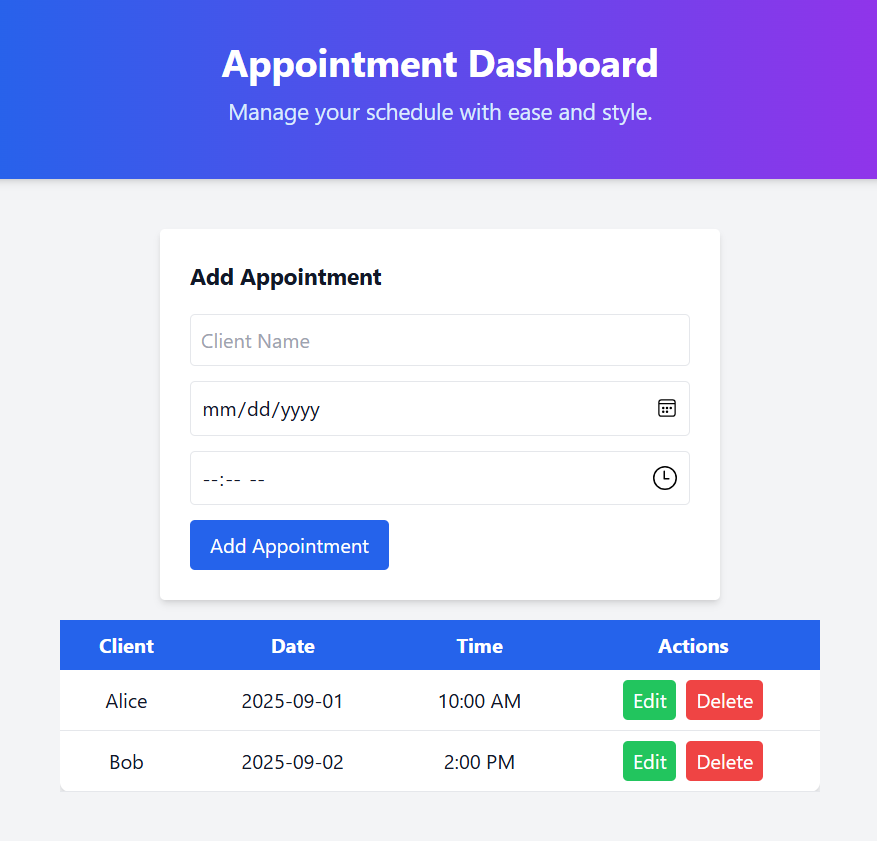
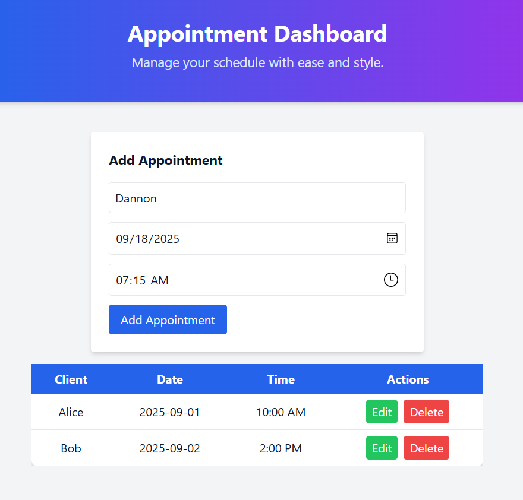
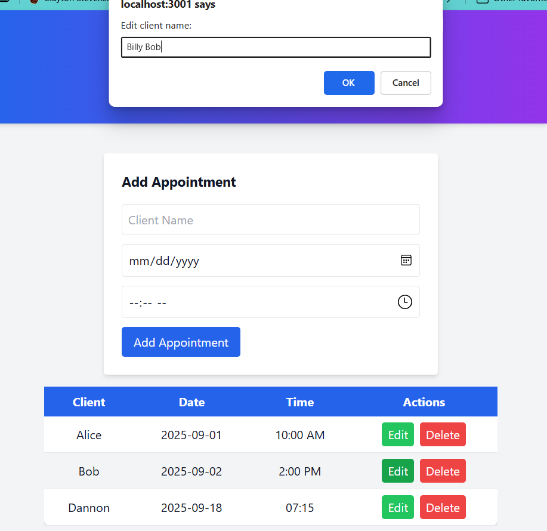
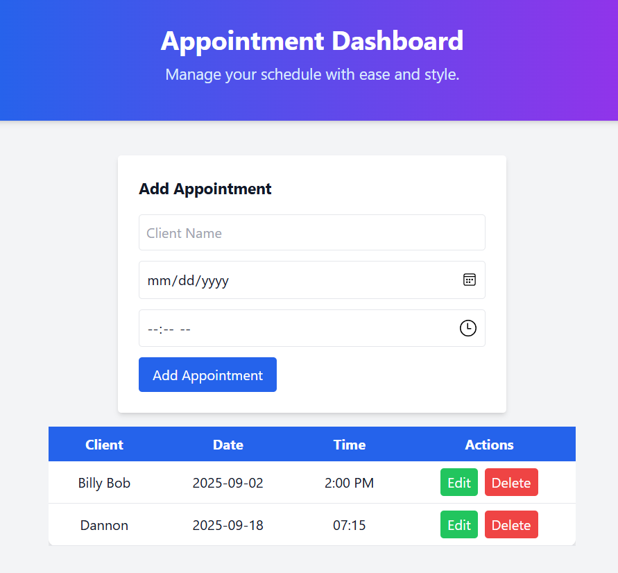

# Appointment Scheduler - Frontend

A modern, responsive, and user-friendly **Appointment Scheduler** built with **React** and **Tailwind CSS**. This frontend application allows users to manage their appointments with ease, offering a clean dashboard, intuitive forms, and a visually appealing interface.  

## Demo
_Include a link to your live demo here if hosted._

## Features
- Add, edit, and delete appointments
- Responsive design that works on desktop and mobile
- Dashboard overview of upcoming appointments
- Interactive forms with validation
- Polished styling using **Tailwind CSS**
- Live deployment on Render, connected to a Spring Boot backend

## Technologies Used
- **React** – Component-based frontend library
- **Tailwind CSS** – Utility-first CSS framework for styling
- **Axios** – For HTTP requests to the backend API
- **React Hooks** – `useState` and `useEffect` for state management and lifecycle
- **Render** - Hosting for live frontend deployment

## Deployment
The frontend is deployed on **Render** for production use.
It iteracts with the backend API using the live backend URL.
**1. Build locally (optional for development):**
   ```
   npm install
   npm run build
   ```
**2. Serve locally for testing (optional):**
   ```
   npm install -g serve
   serve -s build
   ```
**3. Live deployment:**
Hosted on Render at https://appointment-backend-t9yq.onrender.com
   
## Project Structure
   ```
   appointment-frontend/
   ├── public/
   ├── src/
   │   ├── Components/
   │   │   ├── Header.jsx
   │   │   ├── Footer.jsx
   │   │   ├── AppointmentForm.jsx
   │   │   └── AppointmentList.jsx
   │   ├── App.jsx
   │   └── index.js
   ├── package.json
   └── tailwind.config.js
   ```
## Usage

- Navigate to the dashboard to see all upcoming appointments.

- Fill out the “Add Appointment” form to schedule a new appointment.

- Use the Edit and Delete buttons to modify or remove appointments.

## Screenshots

   
   
   
   

## Author

### Dannon Gibby


